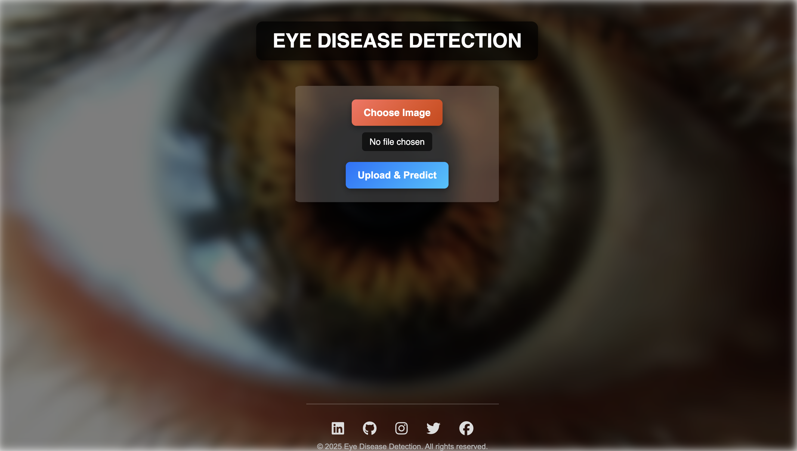
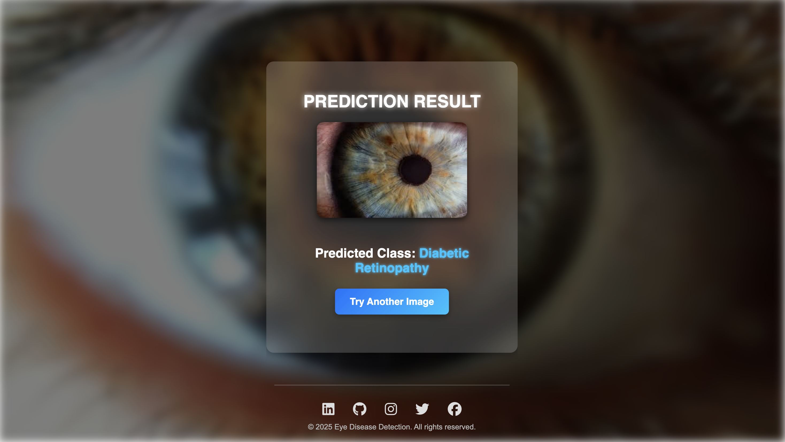

<p align="center">
  
</p>


# 👁️ Eye Disease Detection

An AI-powered **Eye Disease Detection** web application that allows users to **upload eye images** and predicts whether an eye disease is present.

---

## 🚀 Features
- 📷 **Upload** an eye image for disease detection.
- 🔍 **AI-Powered Prediction** using a trained model.
- 🎨 **Smooth UI** with a **blurred background & animations**.
- 📱 **Responsive Design** (works on mobile & desktop).

---

## 🖼️ Example Output

<table>
  <tr>
    <td></td>
    <td></td>
  </tr>
  <tr>
    <td align="center">!st interface</td>
    <td align="center">Result Interface</td>
  </tr>
</table>

---

## 🛠️ Technologies Used
- **Frontend**: HTML, CSS (with animations & responsive design)
- **Backend**: Flask (Python)
- **Machine Learning**: TensorFlow/Keras (for disease prediction)
- **Deployment**: Flask server & GitHub (for hosting)

---

## 📥 Installation & Setup


### Install Dependencies
Make sure you have **Python 3.7+** installed. Then, install the required packages:
```sh
pip install -r requirements.txt
```

### 3️⃣ Run the Flask Server
```sh
python app.py
```
The app will start on **http://127.0.0.1:5000/**.

---

## 🖼️ Project Structure
```
📂 Eye-Disease-Detection/
├── 📁 static/           # CSS, images
├── 📁 templates/        # HTML files
├── 📁 model/            # Trained ML model
├── app.py              # Flask backend
├── model_training.py   # Train Model and save Model
├── requirements.txt    # Dependencies
└── README.md           # Project documentation
```

---

## 🎯 Future Improvements
🚀 **Upgrade AI Model** for more accuracy.  
📊 **Add Confidence Scores** in predictions.  
🌍 **Deploy to Cloud** for public access.  


---

### 🌟 **Star this Repo if you found it useful!** ⭐
# Eye-Disease-Detection

